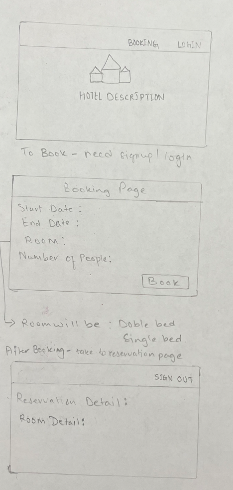

# Newa-Heritage-Hotel Booking Website

A hotel booking website allows people to book a room through this single hotel booking website. This project is built using MERN stack technology. The project features a dynamic home page with the introduction, admin and user dashboards, user login page with all kinds of validations, and the ability for people to view their booking information.

## Screenshots

## ERD

## Wireframes

## Landing Page

## Technologies Used:

- MongoDB

- Express

- React.js

- Node.js

- React Bootstrap

## Getting Started: How the website work

[Heroku]()

[Trello Board](https://trello.com/b/rHt8GhjO/project-4)

## Next Steps:

- After booking complete send booking confirmation

- If rooms are available then display on Calendar

- Add a link in an email to cancel booking
